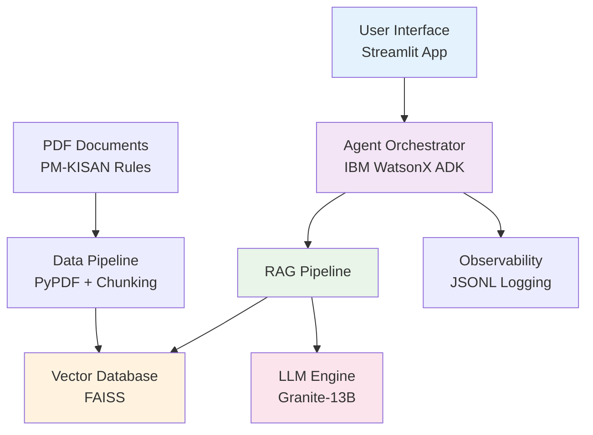

#  Sahay AI: Your Guide to Government Schemes

<div align="center">


*Empowering farmers with AI-powered guidance on PM-KISAN scheme benefits*

[](https://streamlit.io/)
[](https://www.ibm.com/watson)
[](https://python.org/)

</div>

##  Live Demo

> **Note:** GIF placeholder - Record a demo showing the chat interface in action


---

##  Problem Statement

### The Information Gap Crisis

Millions of deserving farmers in India remain unaware of government welfare schemes designed to support them. The **Pradhan Mantri Kisan Samman Nidhi (PM-KISAN)** scheme alone aims to benefit **12.5 crore farmer families**, yet many face critical barriers:

- ** Lack of Awareness**: Farmers don't know about schemes they're eligible for
- ** Complex Documentation**: Official documents are dense and difficult to understand  
- ** Cumbersome Processes**: Application procedures can be daunting, especially for those with limited digital literacy
- ** Language Barriers**: Information is often not available in local languages

This leads to **chronic underutilization** of benefits designed to improve livelihoods and promote social equity.

---

##  Solution: Sahay AI

**Sahay AI** is a **personalized, conversational AI agent** designed to be a trusted assistant for every citizen. It transforms the daunting task of navigating government schemes into a simple, empowering conversation.

###  Key Features

- ** Intelligent RAG System**: Retrieval-Augmented Generation using official PM-KISAN documents
- ** Natural Conversations**: Chat-based interface that understands farmer queries in plain language
- ** Accurate Information**: Responses based solely on official government documentation
- ** Real-time Responses**: Powered by IBM WatsonX Granite-13B model
- ** Complete Observability**: Every interaction logged for transparency and improvement
- ** User-Friendly Interface**: Clean Streamlit web application with intuitive design

###  What Sahay AI Does

Through a lightweight, multilingual chat interface, Sahay AI:

 **Understands** user's unique profile and needs  
 **Identifies** relevant PM-KISAN scheme benefits  
 **Explains** complex eligibility criteria in simple, clear language  
 **Provides** step-by-step guidance through procedures  
 **Answers** specific questions about amounts, timelines, and requirements  

---

##  Technical Architecture

###  High-Level Architecture



###  Technology Stack

| Component | Technology | Purpose |
|-----------|------------|---------|
| ** LLM Engine** | IBM WatsonX Granite-13B | Natural language understanding & generation |
| ** RAG Pipeline** | LangChain + FAISS | Retrieve relevant context from documents |
| ** Embeddings** | HuggingFace MiniLM-L6-v2 | Convert text to vector representations |
| ** User Interface** | Streamlit | Interactive web application |
| ** Document Processing** | PyPDF + RecursiveCharacterTextSplitter | PDF parsing and chunking |
| ** Observability** | JSONL Logging | Track interactions and performance |
| ** Agent Framework** | IBM WatsonX ADK | Agent orchestration and management |

###  IBM Open-Source Stack Integration

Sahay AI leverages a powerful suite of **IBM's open-source tools**:

- ** IBM Agent Development Kit (ADK)**: Core agent orchestration and management
- ** IBM Granite Models**: Advanced NLU, multilingual NLG, and abstractive summarization  
- ** IBM Docling**: Parse and extract structured information from government PDFs
- ** IBM Data Prep Kit (DPK)**: Clean and prepare extracted text for reliable use
- ** IBM AI Fairness 360 (AIF360)**: Audit recommendation algorithms for demographic biases
- ** IBM AI Explainability 360 (AIX360)**: Provide transparent explanations for recommendations

---

##  Getting Started

###  Prerequisites

- **Python 3.8+** installed on your system
- **IBM WatsonX Account** with API credentials
- **Git** for cloning the repository

###  Clone the Repository

```bash
git clone https://github.com/your-username/sahay-ai-hackathon.git
cd sahay-ai-hackathon
```

###  Set Up Environment Variables

Create a `.env` file in the root directory:

```bash
# Create .env file
touch .env
```

Add your IBM WatsonX credentials to the `.env` file:

```env
# IBM WatsonX Credentials
WATSONX_API_KEY=your_watsonx_api_key_here
WATSONX_PROJECT_ID=your_watsonx_project_id_here
```

> ** Security Note:** Never commit your `.env` file to version control. It's already included in `.gitignore`.

###  Install Dependencies

```bash
# Create virtual environment (recommended)
python -m venv venv

# Activate virtual environment
# On Windows:
venv\Scripts\activate
# On macOS/Linux:
source venv/bin/activate

# Install required packages
pip install -r requirements.txt
```

###  Prepare the Knowledge Base

Place the PM-KISAN PDF document in the `data/` directory and run the ingestion pipeline:

```bash
# Copy the PM-KISAN PDF to the data directory
cp PMKisanSamanNidhi.PDF data/pm_kisan_rules.pdf

# Run the data ingestion pipeline
python src/ingest.py
```

**Expected output:**
```
 Starting Sahay AI Data Ingestion Pipeline
==================================================
 Loading PDF document...
 Successfully loaded 4 pages from PDF
 Splitting text into chunks...
 Created 12 text chunks
 Initializing embeddings model...
 Embeddings model 'sentence-transformers/all-MiniLM-L6-v2' loaded successfully
 Creating vector database...
 Vector database saved successfully at data/vector_db
 Data ingestion pipeline completed successfully!
```

###  Launch the Application

```bash
# Start the Streamlit web application
streamlit run src/app.py
```

The application will open in your browser at `http://localhost:8501` 

---

##  Usage Guide

###  Using the Chat Interface

1. **Start a Conversation**: Type your question about PM-KISAN in the input box
2. **Get Instant Answers**: Sahay AI will process your query and provide accurate information
3. **Continue Chatting**: Ask follow-up questions naturally
4. **Use Sample Questions**: Click on sidebar buttons for common queries

###  Example Conversations

**User**: "What is PM-KISAN scheme?"  
**Sahay AI**: "PM-KISAN is the Pradhan Mantri Kisan Samman Nidhi scheme launched by the Government of India to supplement the financial needs of Small and Marginal Farmers (SMFs)..."

**User**: "How much money do farmers receive?"  
**Sahay AI**: "Under the PM-KISAN scheme, eligible landholding SMF families receive a direct payment of Rs. 6000 per year, transferred in three equal installments of Rs. 2000 each every four months..."

###  Best Practices

- **Be Specific**: Ask clear, focused questions about PM-KISAN
- **One Topic**: Ask one question at a time for best results  
- **Use Keywords**: Include terms like "eligibility", "benefits", "application", etc.
- **Follow Up**: Ask clarifying questions based on the responses

---

## 📁 Project Structure

```
sahay-ai-hackathon/
│
├── 📄 .gitignore              # Git ignore rules
├── 📖 README.md               # This documentation file  
├── 📦 requirements.txt        # Python dependencies
│
├── 📂 data/
│   ├── 📄 pm_kisan_rules.pdf   # Source PM-KISAN document
│   └── 🗄️ vector_db/           # Generated FAISS database
│
├── 📂 src/
│   ├── 📄 __init__.py          # Package marker
│   ├── 🔄 ingest.py            # PDF to vector database pipeline
│   ├── 🤖 agent.py             # Core IBM WatsonX RAG agent
│   └── 🎨 app.py               # Streamlit web interface
│
└── 📂 logs/
    └── 📊 interactions.jsonl   # Agent interaction logs
```

---

##  Development & Customization

###  Testing the Agent

You can test the agent functionality directly:

```bash
# Test the agent with sample queries
python src/agent.py
```

###  Monitoring & Observability

All interactions are logged in `logs/interactions.jsonl`:

```json
{
  "timestamp": "2025-09-10T15:30:45.123456+00:00",
  "user_query": "What is PM-KISAN scheme?",
  "retrieved_context": ["Context chunk 1...", "Context chunk 2..."],
  "agent_response": "PM-KISAN is a Central Sector Scheme..."
}
```

###  Customizing the Interface

The Streamlit interface can be customized by modifying `src/app.py`:
- Update CSS styles in the `initialize_streamlit_config()` function
- Add new features in the main application flow
- Modify the sidebar content and sample questions

###  Adding New Documents

To add more government scheme documents:

1. Place PDF files in the `data/` directory
2. Modify `src/ingest.py` to process multiple documents
3. Update the agent prompt to handle broader scheme coverage

---

##  Innovation & Impact

###  Innovation Highlights

- ** Agentic Design**: User-centric conversational approach that simplifies bureaucracy
- ** Integrated AI Stack**: Powerful combination of IBM AI technologies for transparency and fairness
- ** RAG Architecture**: Ensures responses are grounded in official documentation
- ** Responsible AI**: Built-in observability and explainability features

###  Expected Impact

- ** Increased Uptake**: More farmers accessing welfare schemes they're eligible for
- ** Citizen Empowerment**: Better understanding of rights and benefits
- ** Financial Inclusion**: Reduced reliance on intermediaries and middlemen
- ** Better Governance**: More accessible and equitable public services

---

##  Roadmap

###  Phase 1: MVP (Current)
-  Core RAG pipeline with PM-KISAN documents
-  IBM WatsonX integration
-  Streamlit web interface
-  Complete observability system

###  Phase 2: Enhancement
-  Multi-language support with Granite models
-  Expand to top 15 national schemes
-  Enhanced UI/UX with advanced features
-  Mobile-responsive design

###  Phase 3: Scale
-  State-specific scheme integration
-  User testing with farmer communities
-  Production deployment architecture
-  Performance optimization

---

##  Contributing

We welcome contributions to make Sahay AI even better! Here's how you can help:

1. ** Fork the repository**
2. ** Create a feature branch** (`git checkout -b feature/AmazingFeature`)
3. ** Commit your changes** (`git commit -m 'Add some AmazingFeature'`)
4. ** Push to the branch** (`git push origin feature/AmazingFeature`)
5. ** Open a Pull Request**

###  Areas for Contribution

-  **Multi-language Support**: Add support for regional Indian languages
-  **New Schemes**: Integration with additional government schemes
-  **UI/UX**: Improve the user interface and experience
-  **Testing**: Add comprehensive test cases
-  **Documentation**: Improve documentation and tutorials

---

##  License

This project is licensed under the MIT License - see the [LICENSE](LICENSE) file for details.

---

##  Support & Contact

- ** Email**: jagadeep.mamidi@gmail.com

---

<div align="center">


*Making government schemes accessible to everyone, one conversation at a time.*

</div>
